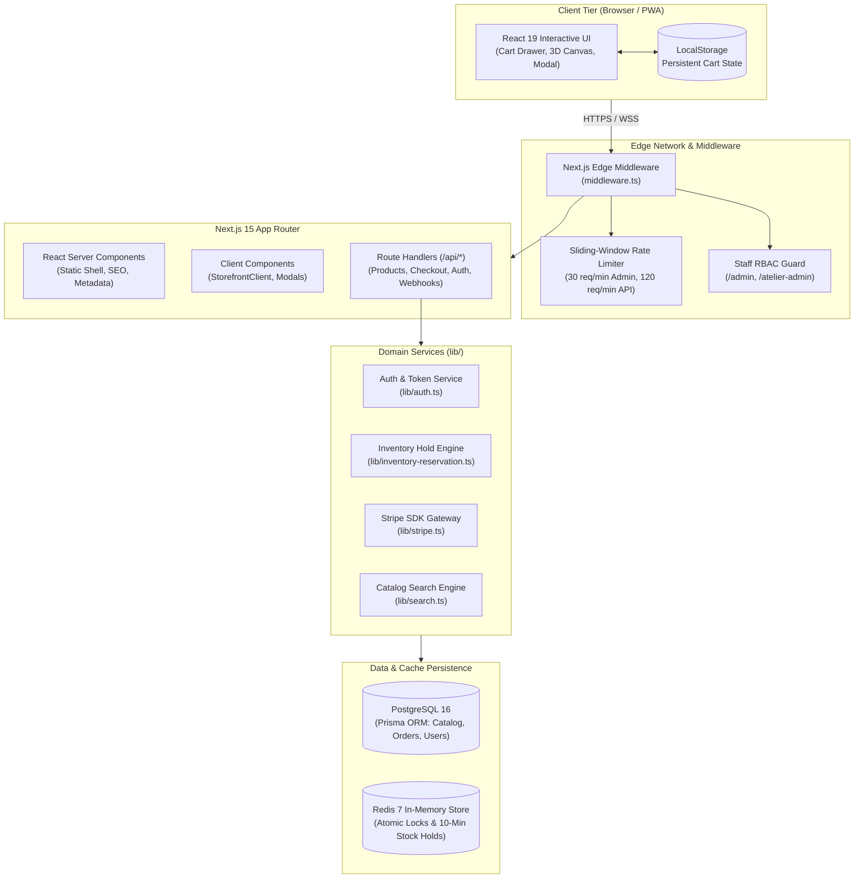
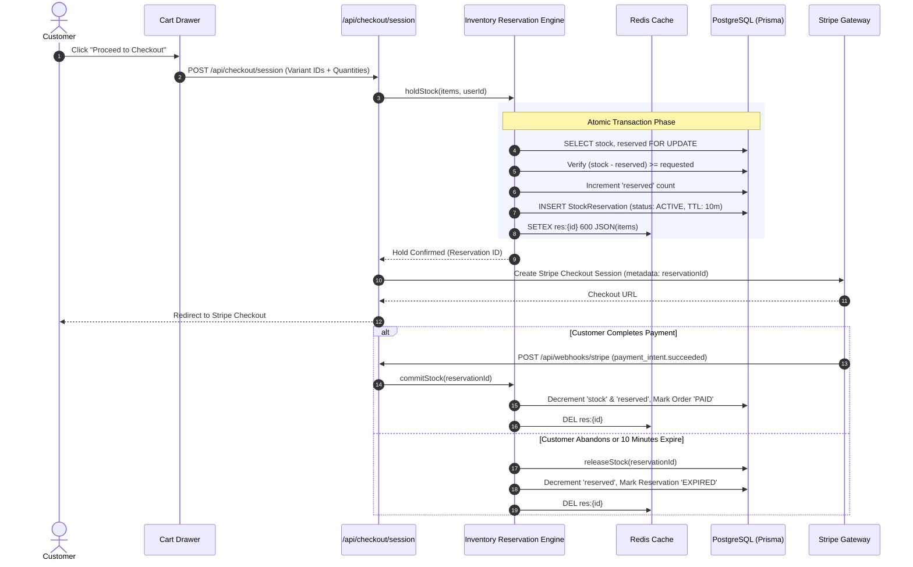

# Architecture & System Design — Aura Apparel

## 1. Executive Summary

Aura Apparel is engineered as a high-performance, full-stack luxury e-commerce web platform. It leverages **Next.js 15 (App Router)** and **React 19** to deliver server-rendered, SEO-optimized editorial pages alongside low-latency, highly interactive client-side shopping experiences.

The architecture emphasizes:
1. **Visual Elegance & Speed:** Instant page delivery, minimal bundle size, and fluid layout transitions.
2. **Transactional Integrity:** Race-condition-free inventory reservations during high-traffic product drops.
3. **Defense-in-Depth Security:** Edge-level rate limiting, JWT-based Role-Based Access Control (RBAC), and brute-force lockout mechanisms.

---

## 2. High-Level System Topology

---

## 3. Edge Middleware Layer (`middleware.ts`)

The edge middleware interceptor executes on all incoming requests before hitting route handlers or page renderers:

### A. Sliding-Window Rate Limiting
- **General APIs (`/api/products`, `/api/search`):** 120 requests per minute per IP.
- **Sensitive APIs (`/api/auth/*`, `/api/admin/*`):** 30 requests per minute per IP.
- **Response:** Emits HTTP `429 Too Many Requests` with RFC-compliant headers (`X-RateLimit-Limit`, `X-RateLimit-Remaining`, `Retry-After: 60`).

### B. Staff RBAC Route Guard
- Intercepts requests targeting `/admin` and `/atelier-admin` (excluding login pages).
- Verifies JWT authorization tokens (`aura_staff_token` or `aura_session`) using `jose`.
- Enforces role verification: Only users with `SUPER_ADMIN`, `MERCHANDISER`, or `FULFILLMENT` roles are permitted access; unauthorized traffic is automatically redirected to the atelier login page.

---

## 4. Dual-Engine Inventory Reservation System

During exclusive luxury drops, multiple shoppers may attempt to purchase the same limited-run SKU simultaneously. Traditional decrement-at-checkout approaches lead to overselling or cart abandonment race conditions.

Aura Apparel utilizes a **Two-Tier 10-Minute Atomic Hold Strategy**:

### Fallback Resilience
In local development or test environments where Redis or PostgreSQL instances may be unseeded or isolated, `lib/inventory-reservation.ts` provides an in-memory concurrent map fallback with automated timeouts, guaranteeing zero crashes.

---

## 5. Stripe Webhook & Payment Lifecycle

- **Idempotent Handling:** Every webhook event is verified against the `STRIPE_WEBHOOK_SECRET` signature.
- **Events Handled:**
  - `checkout.session.completed`: Creates the permanent `Order` entity, generates the unique `orderNumber`, populates line items with pricing snapshots, and sets status to `PAID`.
  - `payment_intent.payment_failed`: Releases the inventory hold immediately so other shoppers can purchase the item.

---

## 6. Client vs. Server State Architecture

| Concern | Implementation | Persistence Layer |
| :--- | :--- | :--- |
| **Catalog Browsing** | Server Components with client hydration | PostgreSQL via Prisma |
| **Cart Items & Quantities** | React Context (`useCart`) | `localStorage` (`aura_cart_v1`) |
| **Active Checkout Hold** | Server-side reservation ID | Redis TTL + PostgreSQL `StockReservation` |
| **Customer Auth State** | HTTP-Only Secure JWT Cookie | Signed JOSE token |
| **Search Query & Filters** | URL Query Params + Client State | Browser history |
