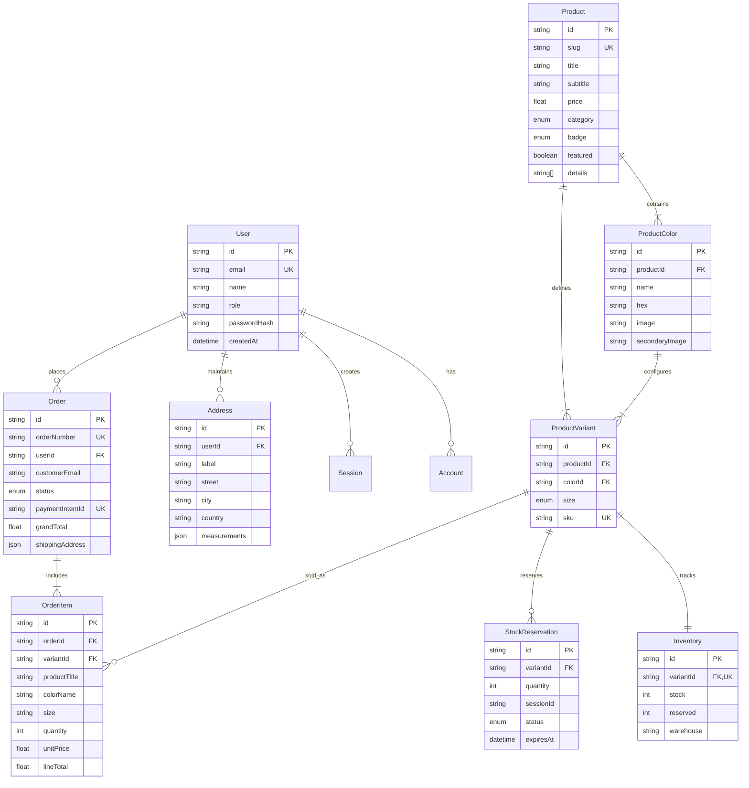

# Database Architecture & Data Modeling — Aura Apparel

## 1. Overview

The Aura Apparel database layer is built on **PostgreSQL 16** and orchestrated through **Prisma ORM 6.4**. The schema is engineered to handle complex luxury fashion SKU matrices (multiple colorways and sizing permutations per garment) while enforcing atomic stock reservations to prevent overselling during high-concurrency collection drops.

---

## 2. Entity-Relationship Diagram (ERD)



---

## 3. Enumerations

| Enum Name | Possible Values | Usage |
| :--- | :--- | :--- |
| `Role` | `CUSTOMER`, `MERCHANDISER`, `FULFILLMENT`, `SUPER_ADMIN` | Staff RBAC and user permission tiers |
| `Category` | `OUTERWEAR`, `ESSENTIALS`, `SUMMER_DROP` | Top-level catalog classification |
| `ProductBadge` | `EXCLUSIVE`, `NEW_ARRIVAL`, `BESTSELLER`, `SUMMER_DROP` | Editorial merchandising highlight badges |
| `ProductSize` | `XS`, `S`, `M`, `L`, `XL`, `ONE_SIZE` | Standard garment sizing options |
| `OrderStatus` | `PENDING`, `PAID`, `FULFILLED`, `CANCELLED` | Order progression state machine |
| `ReservationStatus`| `ACTIVE`, `COMMITTED`, `EXPIRED` | 10-minute cart inventory hold lifecycle |

---

## 4. Key Models & Schema Deep-Dive

### A. The Product SKU Matrix (`Product`, `ProductColor`, `ProductVariant`)
Unlike simple e-commerce models where an item is a single record, luxury garments require multi-tier representations:
- **`Product`**: High-level garment entity (e.g., *"Double-Faced Cashmere Overcoat"*), containing title, editorial description, price, and fabrication details array.
- **`ProductColor`**: Visual fabric options with corresponding photographic assets and hex codes.
- **`ProductVariant`**: The unique sellable physical item identified by a distinct **SKU** (e.g., `AURA-OC-BLK-M`), linking a specific `Product`, `ProductColor`, and `ProductSize`.

### B. Inventory & Concurrency Management (`Inventory`, `StockReservation`)
- **`stock`**: Physical items located in the warehouse (`MILAN_ATELIER`).
- **`reserved`**: Items held in active checkout sessions (TTL: 10 minutes).
- **Available Units Formula:**
  $$\text{Available Stock} = \text{stock} - \text{reserved}$$
- **`StockReservation`**: Tracks the temporary claim with a hard `expiresAt` timestamp. If an order completes, status transitions from `ACTIVE` to `COMMITTED`. If abandoned, the reservation becomes `EXPIRED`, and the `reserved` count on `Inventory` decrements automatically.

### C. Orders & Historical Snapshots (`Order`, `OrderItem`)
- `OrderItem` explicitly preserves a snapshot of `productTitle`, `colorName`, `size`, and `unitPrice` at the exact moment of purchase. This guarantees historical financial accuracy even if future product details or prices are revised.
- `Order.shippingAddress` is stored as structured JSON, decoupling customer address changes in `/account` from past completed orders.

### D. Bespoke Tailoring Measurements (`Address.measurements`)
- In `Address`, a dedicated JSON field stores custom atelier tailoring notes:
  ```json
  {
    "chest": "40 inches",
    "waist": "32 inches",
    "sleeve": "34 inches",
    "inseam": "31 inches",
    "notes": "Slight taper on trouser cuff"
  }
  ```

---

## 5. Indexing & Query Optimization

| Model | Indexed Fields | Optimization Purpose |
| :--- | :--- | :--- |
| `Product` | `category`, `featured` | Sub-5ms storefront category filtering & hero queries |
| `ProductVariant` | `productId`, `colorId`, `sku` (unique) | Instant SKU lookup and modal swatch rendering |
| `Inventory` | `variantId` (unique) | Fast row-level locks during atomic checkout reservations |
| `StockReservation`| `variantId`, `sessionId`, `expiresAt` | High-frequency expiration sweeps and session checkouts |
| `Order` | `customerEmail`, `status`, `orderNumber` (unique) | Immediate customer order lookup and admin status queries |
| `User` | `email` (unique) | Fast session and auth retrieval |
